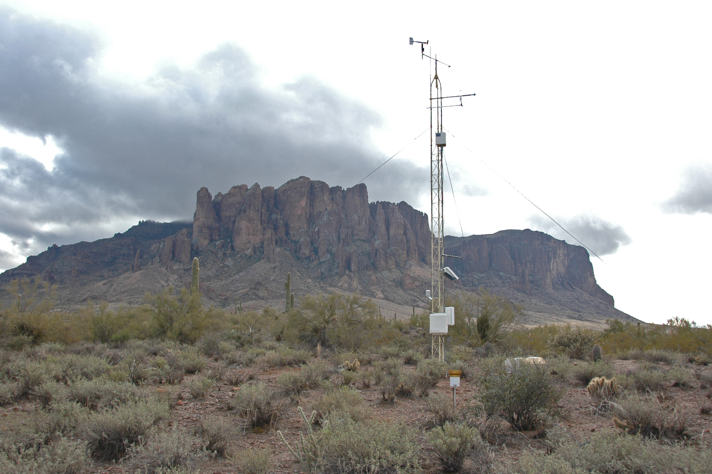

## AI-in-a-day

Generative Artificial Intelligence (GenAI) tools such as ChatGPT, Google Gemini, and GitHub CoPilot are rapidly transforming environmental science, yet many researchers lack a foundational understanding of these tools and the time or resources to learn them. To bridge this gap, we propose “AI in a Day”: a suite of open-access, community-driven training modules that equip environmental scientists to integrate AI effectively and responsibly into their research. Delivered through ESIIL workshops, conferences, and online platforms, modular materials will provide practical, up-to-date guidance that democratizes AI knowledge and empowers scientists across career stages to engage fully in the evolving landscape of AI-enabled environmental science.

This working group runs as a single system: a GitHub repository where environmental data science is organized, analyzed, and versioned, and a public website where results are explained and shared with the community.

As the working group progresses, the repository becomes the reproducible record of the science, and the website becomes the public report.

[Edit this homepage in GitHub](https://github.com/CU-ESIIL/AI-in-a-day/edit/main/docs/index.md){ .md-button .md-button--secondary }
[Open the GitHub repository](https://github.com/CU-ESIIL/AI-in-a-day){ .md-button }

{ .homepage-hero }

--8<-- "_generated/slot_notes/hero.md"

## Working Group Abstract

GenAI is reshaping the scientific landscape, with the speed and magnitude of transformation set to accelerate. This emerging paradigm has profound implications for environmental science, where computationally intensive workflows are common. Yet many environmental scientists are constrained by limited time, resources, and tools designed specifically for their domain, making it difficult to keep up with the breakneck evolution of GenAI and integrate it meaningfully into their research. We propose to help fill this critical gap by developing a suite of “AI in a Day” community-driven training modules designed to provide environmental scientists with easily digestible resources that will empower them to capitalize on AI-enabled tools and workflows. We envision open-source training materials that will be available online as well as delivered by ESIIL workshop practitioners to audiences at scientific conferences and workshops, university seminars, and to research teams. The materials will be designed to be modular and we will foster a community of curators so that the resources remain relevant as technologies and approaches evolve.

## Start Here

1. Keep the title and summary aligned with the working group question and community need.
2. Add the core datasets, working documents, and references as they become available.
3. Use this site to post progress updates, methods notes, and outputs throughout the year.

[Plan the work](work-plan.md){ .md-button }
[Document data and resources](how-this-group-works.md#data){ .md-button .md-button--secondary }
[Set community expectations](community-care.md){ .md-button .md-button--secondary }

## Working Group Landmarks

Use these lightweight labels to connect work sessions, meeting notes, and homepage edits:

WG-A People and roles; WG-B Question and scope; WG-C Data and access; WG-D Methods and workflows; WG-E Results and synthesis; WG-F Outputs and handoff.

[Use the landmark guide](instructions/working-group-landmarks.md){ .md-button .md-button--secondary }

## How This Repo Is Organized

The repository has two connected layers. Top-level files configure the project and its automation. The `docs/` folder contains the website content. `mkdocs.yml` tells MkDocs how to turn that content into the public site. Analysis folders hold the working scientific materials that generate the results shown on the website.

| Part of the repo | What it does | What usually belongs there |
| --- | --- | --- |
| Top-level files and folders | Configure the project and keep shared repository guidance in one place | `README.md`, `LICENSE`, workflows, containers, templates, environment setup, and repo-wide metadata |
| `docs/` | Stores the source content for the public website | Homepage text, summaries, methods, community-facing documentation, and website assets |
| `mkdocs.yml` | Controls how the site is rendered | Navigation, theme settings, plugins, and GitHub edit links |
| Working folders | Hold the science-in-progress | Data references, notebooks, scripts, workflows, figures, outputs, and reproducibility materials |

## Repository Side: Do the Science

Use the repository as the operational record of the project and update this section with concrete links as those resources are created.

Related landmarks: WG-C Data and access; WG-D Methods and workflows.

The repository is the working record of the group: it tracks what changed, why it changed, and how results were produced.

- Data sources and metadata
- Notebooks and scripts
- Workflows and reproducible analysis
- Meeting notes and decisions
- Figures, tables, and other outputs

## Website Side: Share the Science

Use the website as the public-facing report and keep narrative pages up to date as milestones are reached.

Related landmarks: WG-E Results and synthesis; WG-F Outputs and handoff.

The website turns the working group record into a readable public report.

- Plain-language summaries
- Methods documentation
- Figures, maps, and visualizations
- Meeting outputs and synthesis products
- Manuscripts, reports, or educational materials

## How the Two Sides Connect

The repository and website are not separate products. When the group updates data, analysis code, figures, or written summaries in GitHub, those changes can be rendered through the website. Commits are the bridge between doing the science and sharing the science.

## When This Working Group Is Live

A working group is live when:

- The research question is stated
- Data sources are linked or documented
- At least one analysis or workflow is runnable
- Outputs are committed to the repository
- The website explains what the group is doing and why it matters

For guidance on turning this scaffold into a public scientific record, see the [Public-Facing Site Guide](public-facing-site-guide.md).

## Early Process Snapshot

This section can host one or two key kickoff visuals or summaries once the first meeting materials are available.

## Key Links to Replace

Use this section for the links your group will actually maintain. Replace each placeholder with the working document, repository resource, dataset hub, or output page that your collaborators should use.

- Main Working Document: add URL here
- GitHub Repository: https://github.com/CU-ESIIL/AI-in-a-day
- Data / Resources: add URL here
- Outputs / Dashboard: add URL here

## Current Phase

Working Phase: Preparing for Meeting 1
- developing AI-needs survey
- meeting logistics

## Team Members

Add a group photo after the first in-person meeting.

|Name                |Project Role             |Institution                                                                          |Responsibilities |
|:-------------------|:------------------------|:------------------------------------------------------------------------------------|:----------------|
|Li Kui              |Co-PI                    |University of California, Santa Barbara                                              |NA               |
|Sarah Elmendorf     |Co-PI                    |University of Colorado                                                               |NA               |
|Stevan Earl         |Co-PI; ESIIL Tech Lead   |Arizona State University                                                             |NA               |
|Nick J Lyon         |Co-PI; ESIIL Collab Lead |Long Term Ecological Research Network Office, University of California Santa Barbara |NA               |
|Nate Emery          |Co-PI                    |University of California, Santa Barbara                                              |NA               |
|Carmen Galaz García |Member                   |University of California, Santa Barbara                                              |NA               |
|Rui Cheng           |Member                   |Claremont McKenna College                                                            |NA               |
|Bobby Hodgkinson    |Member                   |University of Colorado                                                               |NA               |
|Sue McClatchy       |Member                   |Jackson Laboratory                                                                   |NA               |
|Greg Maurer         |Member                   |New Mexico State University                                                          |NA               |
|Nathan Quarderer    |Member                   |University of Colorado                                                               |NA               |
